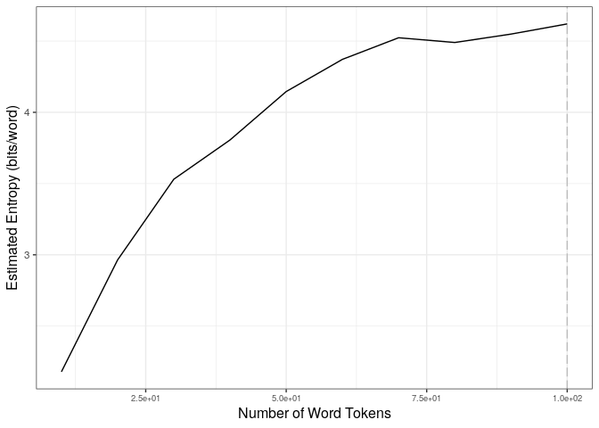

# Hrate package

# Introduction

This package implements the *increasing window entropy estimator* (i.e.,
LZ78) as described in Gao et al. (2008), Bentz and Alikaniotis (2016),
and Bentz et al. (2017) to estimate the entropy rate of a sequence of
symbols. The package provides two main functions: get.estimate() and
stabilize.estimate(). The first function gives a single estimate for a
pre-specified number of tokens. The second function calculates the
entropy rate for a pre-specified set of token counts (i.e. step sizes).
It also provides the standard deviations of entropy rate estimates for a
pre-specified window of step sizes. This helps to establish the number
of tokens necessary for entropy rates to “stabilize”.

The entropy rate estimator implemented here is given in Equation (6) in
Gao et al. (2008). In the notation of Bentz et al. (2017), Equation (9)
it is defined as:

$\hat{h}=\frac{1}{N}\sum_{i=2}^{N}\frac{\log_2(i)}{L_i}.$

$L_i$ is here the length(+1) of the longest contiguous sub-sequence
encountered before position $i$ which is also encountered from position
$i$ forward. Note that our implementation starts at position $i=1$,
rather than $i=2$. This does not make a numerical difference, since for
$i=1$ we always have $\log_2(1) = 0$, and $L_i$ = 1, hence the ratio is
$0$.

# Installation

Install either directly from GitHub

``` r
library(devtools)
install_github("dimalik/Hrate")
```

or from the tarball

``` r
install.packages("Hrate.tar.gz", repos=NULL, type="source")
```

# Usage

In the study by Bentz et al. (2017), symbols are words. Below this is
illustrated with a dataset consisting of pre-processed text of the
German version of the European Parliament Corpus (EPC) (Koehn, 2005).
However, any sequence of symbols can be used instead.

``` r
library(Hrate)
# load the provided demo corpus: 50 K tokens of the German Europarl 
data(deuparl)
# punctuation and numbers are removed and word tokens are set to lower case
deuparl[1:10]
```

    ##  [1] "wiederaufnahme"  "der"             "sitzungsperiode" "ich"            
    ##  [5] "erkläre"         "die"             "am"              "freitag"        
    ##  [9] "dem"             "dezember"

## Get Entropy Rate Estimate

The get.estimate() function outputs a single entropy rate estimate on a
vector of symbols, in this particular example, a text tokenized into
words. The “every.word” parameter takes an integer (i) as value, which
determines entropy rate estimation at every i-th token. Hence,
“every.word = 1” specifies that each token should be used for
estimation. To speed up processing only every 2nd, 3rd, n-th token could
be used. The parameter “max.length” determines the maximal number of
elements of the vector used.

The default settings are “every.word = 10”, and “max.length =
length(text)”.

Example: Entropy rate estimation for the first 100 words of the German
Europarl.

``` r
estimate <- get.estimate(text = deuparl, every.word = 1, max.length = 100)
print(estimate)
```

    ## [1] 4.620396

## Get Standard Deviations for Entropy Rate Estimates

The stabilize.estimate() function gives standard deviations for entropy
rate estimates. “every.word” and “max.length” are the same as in
get.estimate(). Additionally, “step.size” is an argument specifying step
sizes (in number of tokens) at which entropy rates are calculated.
Hence, “every.word” can be assigned any integer between 1 and the step
size. The “rate” parameter gives the downsampling rate to get standard
deviations (SDs) over a given number of entropy rate estimations,
i.e. step sizes (see Section 4.2 in \[3\]). Beware: The “rate” parameter
should be an integer $>1$, otherwise no SD can be computed and NAs will
result. Also, note that the ratio between max.length/step.size should be
divisible by the rate value.

The default settings are “every.word = 10,”max.length = length(text)“,
and”rate = 5”. The step.size has to be supplied.

The stabilize.estimate() function returns an S4 object.

``` r
stabilization <- stabilize.estimate(text = deuparl, step.size = 10,  max.length = 100, 
                                         every.word = 1, method = "downsample", rate = 5)
```

To extract the step sizes (Corpus.Size) and estimated entropy rates
(Entropy) from the S4 object, the get.stabilization() function is
provided.

``` r
get.stabilization(stabilization)
```

    ##    Corpus.Size  Entropy
    ## 1           10 2.179106
    ## 2           20 2.964245
    ## 3           30 3.530553
    ## 4           40 3.805991
    ## 5           50 4.145775
    ## 6           60 4.371618
    ## 7           70 4.523273
    ## 8           80 4.489947
    ## 9           90 4.549013
    ## 10         100 4.620396

To extract standard deviations for entropy rate estimates from the S4
object, the get.criterion() function is provided.

``` r
print(get.criterion(stabilization))
```

    ##   Corpus.Size        SD
    ## 1          50 0.7730608
    ## 2         100 0.0914242

These results can also be plotted with the plot() function. The number
of tokens (Corpus.Size) is given on the x-axis, and the estimated
entropy rate on the y-axis. The number of tokens associated with the
minimum SD value is plotted as a dashed vertical line.

``` r
print(plot(stabilization))
```

<!-- -->

# Note

For extremely repetitive sequences, the estimator converges slowly, and
has an overestimation bias towards the end of the sequence, since $L_i$
necessarily becomes smaller. For example, if we use a process of
sequence generation which simply concatenates the same symbol, the
theoretical entropy rate is zero, but the estimated entropy rate is
$> 0$ for the generated sequences with finite number of tokens.

``` r
sequence <- rep("a", 100)
print(sequence)
```

    ##   [1] "a" "a" "a" "a" "a" "a" "a" "a" "a" "a" "a" "a" "a" "a" "a" "a" "a" "a"
    ##  [19] "a" "a" "a" "a" "a" "a" "a" "a" "a" "a" "a" "a" "a" "a" "a" "a" "a" "a"
    ##  [37] "a" "a" "a" "a" "a" "a" "a" "a" "a" "a" "a" "a" "a" "a" "a" "a" "a" "a"
    ##  [55] "a" "a" "a" "a" "a" "a" "a" "a" "a" "a" "a" "a" "a" "a" "a" "a" "a" "a"
    ##  [73] "a" "a" "a" "a" "a" "a" "a" "a" "a" "a" "a" "a" "a" "a" "a" "a" "a" "a"
    ##  [91] "a" "a" "a" "a" "a" "a" "a" "a" "a" "a"

``` r
stabilization <- stabilize.estimate(text = sequence, step.size = 10,  max.length = 100, 
                                         every.word = 1, method = "downsample", rate = 5)
```

``` r
print(get.stabilization(stabilization))
```

    ##    Corpus.Size   Entropy
    ## 1           10 0.3883991
    ## 2           20 0.3238034
    ## 3           30 0.2773687
    ## 4           40 0.2444312
    ## 5           50 0.2198139
    ## 6           60 0.2040362
    ## 7           70 0.1986645
    ## 8           80 0.2036346
    ## 9           90 0.2256656
    ## 10         100 0.3364119

# References

Bentz, C.; Alikaniotis D. The word entropy of natural languages, *arXiv*
2016.

Bentz, C.; Alikaniotis D.; Cysouw, M.; Ferrer-i-Cancho, R. The entropy
of words - learnability and expressivity across more than 1000
languages. *Entropy* 2017.

Gao, Y.; Kontoyiannis, I.; Bienenstock, E. Estimating the entropy of
binary time series: Methodology, some theory and a simulation study.
*Entropy* 2008, 10, 71–99.

Koehn, P. Europarl: A parallel corpus for statistical machine
translation. In Proceedings of the tenth Machine Translation Summit,
Phuket, Thailand, 12-16 September 2005; Volume 5, pp. 79–86.

[](https://travis-ci.org/dimalik/Hrate)
